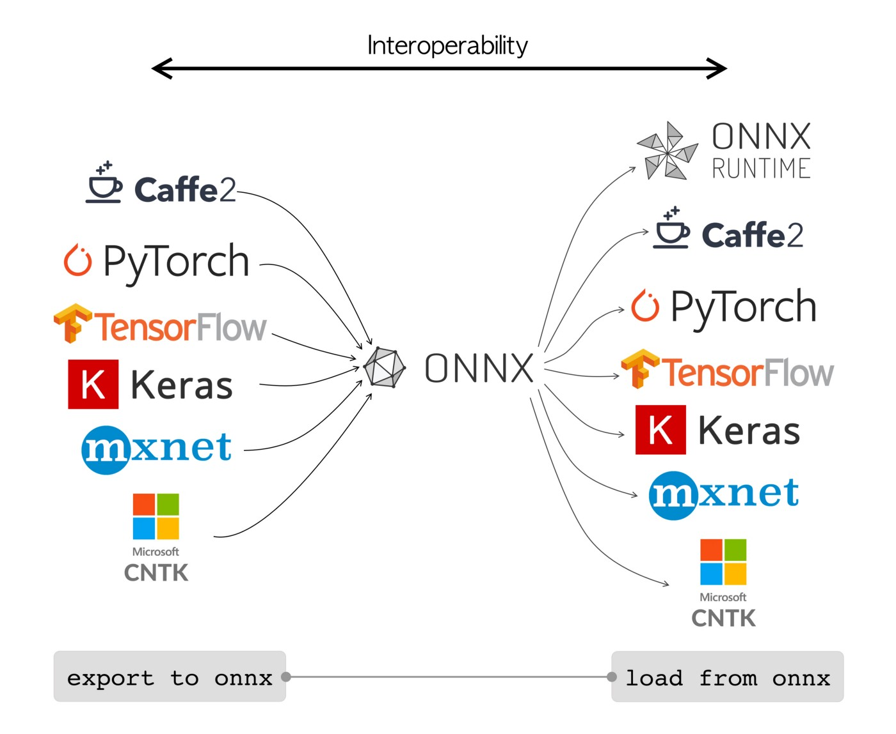
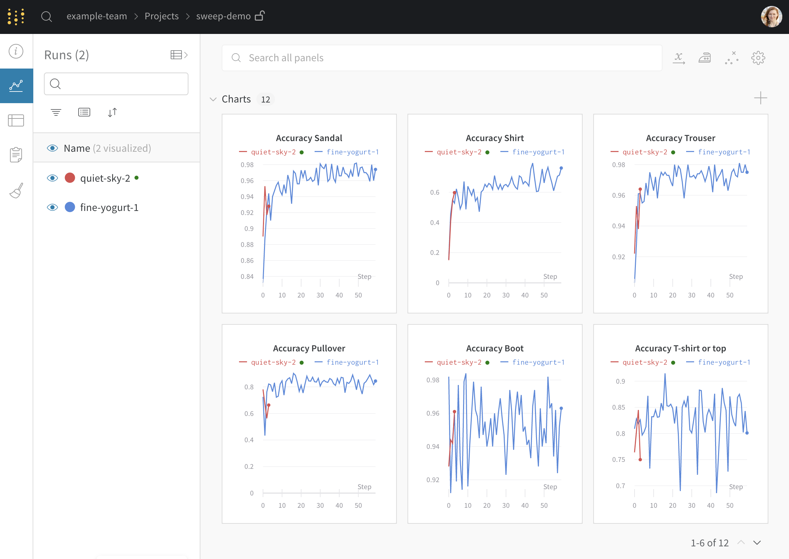

# Chapter 01: The Current Deep Learning Ecosystem


### **DISCLAIMER:** 

В этой части не рассматривается ничего технического в CUDA. Лучше показать вам экосистему вместо того, чтобы вслепую вдаваться в технические детали. Из моего опыта изучения этого материала, имея достаточное понимание экосистемы поможет вам распланировать всё должным образом, и это обеспечит вас мотивацией  к изучению на начальной стадии. 

По мере того, как мы будем углубляться в детали, я рекомендую вам исследовать и экспериментировать с тем, что вам покажется интересным (в этом разделе вы найдете интересные материалы). Если вы просто слушаете, как кто-то рассказывает о предмете в течение 20 часов, вы ограничиваете свои познания. Сложно ориентироваться в широте и глубине инфраструктуры глубокого обучения. Испытывать дискомфорт и ломать что-то - лучший способ учиться.


## Research
- PyTorch ([PyTorch - Fireship](https://www.youtube.com/watch?v=ORMx45xqWkA&t=0s&ab_channel=Fireship))
    - Если вы смотрите это, я предполагаю, что вы имеете хотя бы небольшой опыт работы с PyTorch. Если нет, я предлагаю видео по PyTorch от [Daniel Bourke](https://www.youtube.com/watch?v=Z_ikDlimN6A)
    - Pytorch поставляется с ночной и стабильной версиями ⇒ https://discuss.pytorch.org/t/pytorch-nightly-vs-stable/105633
        
        ночные выпуски, скорее всего, будут нестабильными, но в них будут представлены передовые обновления и оптимизация универсального фреймворка
        
    - Пользователи предпочитают PyTorch благодаря удобству использования
    - Вы найдёте претренированные модели в  torchvision (`pip install torchvision`) и `torch.hub`. Экосистема pytorch развивалась более децентрализовано но немного тяжелее чтобы ориентироваться в подходе к получению предварительно обученных моделей. Люди будут выпускать их модели на гитхаб-репозитории вместо их отправки в централизированную базу данных моделей. Huggingface чаще всего используется благодаря усилиям сообщества
    - Хорошая поддержка ONNX
- TensorFlow ([TensorFlow - Fireship](https://www.youtube.com/watch?v=i8NETqtGHms))
    - Отлично задокументирована и имеет обширное сообщество. Также является одним из наиболее используемый фреймворков глубинного обучения.
    - Comparatively the slowest DL framework
    - Создан компанией Google (designed for TPUs) и общего назначения ML (SVM, decision trees, etc).
    - Претренированный модели могут быть найдены здесь ⇒ https://www.tensorflow.org/resources/models-datasets
    - Хорошая поддержка для претренированных моделей.
    - Ограниченная поддержка ONNX (`tf2onnx`)
- Keras
    - Аналогично `torch.nn` для TensorFlow, но более высокого уровня.
    - Отдельная библиотека но глубоко интегрируется с TensorFlow, служит его основным высокоуровневым API
    - Полноценный фреймворк для создания и обучения модулей, а не только модулей нейронных сетей
- JAX ([JAX - Fireship](https://www.youtube.com/watch?v=_0D5lXDjNpw))
    - JIT-compiled Autograd Xccelerated Linear Algebra
    - Документация здесь ⇒ https://jax.readthedocs.io/en/latest/
    - Выглядит как numpy
    - Reddit сообщество  JAX ⇒ https://www.reddit.com/r/MachineLearning/comments/1b08qv6/d_is_it_worth_switching_to_jax_from/
    - JAX и Tensorflow развиваются компанией Google
    - Использует XLA (xccelerated linear algebra) компилятор
    - `tf2onnx` supported
- MLX
    - Развивается компанией Apple для Apple Silicon
    - Open-source framework
    - Фокусируется на высокопроизводительном машинном обучении на устройствах Apple
    - Спроектирован для тренировки и заключения
    - Оптимизирован для Apple's архитектуры Metal GPU
    - Поддержка динамических вычислительных графов
    - Подходит для исследований и разработки новых моделей ML
- PyTorch Lightning
    - https://www.reddit.com/r/deeplearning/comments/t31ppy/for_what_reason_do_you_or_dont_you_use_pytorch/
    - в основном это сокращение стандартного кода и распределенное масштабирование
    - `Trainer()` в отличие от тренировочного цикла


## Production
- Inference-only
    - vLLM
        - ‣
    - TensorRT
        - Интегрируется в pytorch для inference
        - Поддержка ONNX для загруженных моделей
        - высоко оптимизированные ядра cuda с учетом следующего
            - преимущества разреженности
            - квантование логического вывода
            - аппаратная архитектура
            - схемы доступа к памяти в видеопамяти и встроенной памяти на кристалле
        - сокращение от тензорного времени выполнения
        - разработан, сконструирован и поддерживается компанией Nvidia
        - создан специально для логического вывода LLM
        - использует некоторые из методов, которые мы рассматриваем в этом курсе, но абстрагируется от них для удобства использования
        - похоже, что TensorRT требует, чтобы Onnx изучил это
        - review https://nvidia.github.io/TensorRT-LLM/
        - переходите по ссылкам по порядку для изучения
            - https://nvidia.github.io/TensorRT-LLM/
            - https://nvidia.github.io/TensorRT-LLM/quick-start-guide.html
            - https://pytorch.org/TensorRT/getting_started/installation.html#installation
        - 
- Triton
    - Developed and maintained by OpenAI ⇒ https://openai.com/index/triton/
    - ‣
    - CUDA-like, but in python and gets rid of clutter around kernel development in regular CUDA C/C++. Also matches record performance on Matrix Multiplication
    - Get started ⇒ https://triton-lang.org/main/index.html
    - Write your first Triton kernel ⇒ https://triton-lang.org/main/getting-started/tutorials/index.html
    - Triton Inference Server
        - https://developer.nvidia.com/triton-inference-server
        - ‣
        - 
    - https://www.eecs.harvard.edu/~htk/publication/2019-mapl-tillet-kung-cox.pdf is the original Triton paper
    - triton-viz is Triton’s main profiling and visualization toolkit
    - Python to finely control what happens on the GPU without worrying about the unexpected intricacies and complexities in C/C++.
        - Removes explicit memory management `cudaMalloc`, `cudaMemcpy`, `cudaFree`
        - No need for error checking / macros `CUDA_CHECK_ERROR`
        - Reduced complexity when grid / block / thread level indexing on kernel launch parameters
    

    
- torch.compile
    - Gets more attention than TorchScript and is typically better performance
    - Compiles a model down to a static representation so the dynamic graph component of pytorch doesn’t have to worry about things changing. Runs the model as an optimized binary instead of default out-of-the-box pytorch
    - https://discuss.pytorch.org/t/the-difference-between-torch-jit-script-and-torch-compile/188167
- TorchScript
    - Can be faster in scenarios, especially when deployed in C++
    - Performance gains can be specific to your neural net architecture
    - https://discuss.pytorch.org/t/the-difference-between-torch-jit-script-and-torch-compile/188167
- ONNX Runtime
    - https://youtu.be/M4o4YRVba4o
    - “**ONNX Runtime training** can accelerate the model training time on multi-node NVIDIA GPUs for transformer models with a one-line addition for existing PyTorch training scripts”
    - Developed and maintained by Microsoft
- Detectron2
    - Supports training and inference
    - Computer vision project started at Facebook (Meta)
    - Detection and segmentation algorithms

## Low-Level
- CUDA
    - Compute unified device architecture (CUDA) can be thought of as a programming language for nvidia gpus.
    - CUDA libs ⇒ cuDNN, cuBLAS, cutlass (fast linear algebra and DL algorithms). cuFFT for fast convolutions (FFTs are covered in the course)
    - writing the kernel yourself based on the hardware architecture (Nvidia still does this under the hood for by passing in special flags to the compiler)
- ROCm
    - CUDA equivalent for AMD GPUs
- OpenCL
    - Open Computing Language
    - CPUs, GPUs, digital signal processors, other hardware
    - since NVIDIA designed CUDA, it will outperform OpenCL on Nvidia tasks. If you are doing work with embedded systems (EE/CE), this is still worth learning.

## Inference for Edge Computing & Embedded Systems
    
- Edge Computing refers to low-latency and highly efficient local computing in the context of real-world distributed systems like fleets. Tesla FSD is a prime example of edge computing because it has a neural net running locally on the car. It also has to send data back to Tesla so they can improve their models. 

- CoreML
    - Primarily for deployment of pre-trained models on Apple devices
    - Optimized for on-device inference
    - Supports on-device training
    - Supports a wide range of model types (vision, natural language, speech, etc.)
    - Integrates well with Apple's ecosystem (iOS, macOS, watchOS, tvOS)
    - Focuses on privacy by keeping data on-device
    - Allows model conversion from other frameworks
    - Designed for app developers to easily incorporate ML into their apps
- PyTorch Mobile
- TensorFlow Lite

## Easy to Use
- FastAI
    - High-level API: Built on top of PyTorch, FastAI provides a more user-friendly interface for common deep learning tasks.
    - Rapid prototyping: Designed for quick implementation of state-of-the-art deep learning models.
    - Best practices: Incorporates many best practices and recent advances in deep learning by default.
    - Less code: Typically requires less code to implement complex models compared to raw PyTorch.
    - Transfer learning: Excellent support for transfer learning out of the box.
- ONNX
    - Open Neural Network eXchange
    - `torch.onnx.export(model, dummy_input, "resnet18.onnx")`
    
    ```python
    import tensorflow as tf
    import tf2onnx
    import onnx
    
    # Load your TensorFlow model
    tf_model = tf.keras.models.load_model('path/to/your/model.h5')
    
    # Convert the model to ONNX
    onnx_model, _ = tf2onnx.convert.from_keras(tf_model)
    
    # Save the ONNX model
    onnx.save(onnx_model, 'path/to/save/model.onnx')
    ```
    
    
    
- wandb
    - Short for weights and biases
    - Easy to integrate with projects w/ a few lines of code
    - Team collaboration
    - Compare experiments w/ an intuitive UI
    
    
        
    
## Cloud Providers
- AWS
    - EC2 instances
    - Sagemaker (jupyter notebooks on a cluster, human data labelling/annotation, model training & deployment on AWS infrastructure)
- Google Cloud
    - Vertex AI
    - VM instances
- Microsoft Azure
    - Deep speed
- OpenAI
- VastAI
    - link picture of UI here
- Lambda Labs
    - Cheap datacenter GPUs
## Compilers
- XLA
    - A domain-specific compiler for linear algebra that optimizes TensorFlow computations
    - Provides a lower-level optimization and code generation backend for JAX
    - Performs whole-program optimization, seeing beyond individual operations to optimize across the entire computation graph
    - Enables efficient execution on various hardware (CPUs, GPUs, TPUs) by generating optimized machine code
    - Implements advanced optimizations like operation fusion, which combines multiple operations into a single, more efficient kernel
    - Allows JAX to achieve high performance without manually writing hardware-specific code
- LLVM
- MLIR
- NVCC
    - Nvidia CUDA Compiler
    - Works on everything in the CUDA toolkit
    
    
        
## Misc
- Huggingface