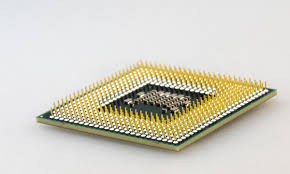
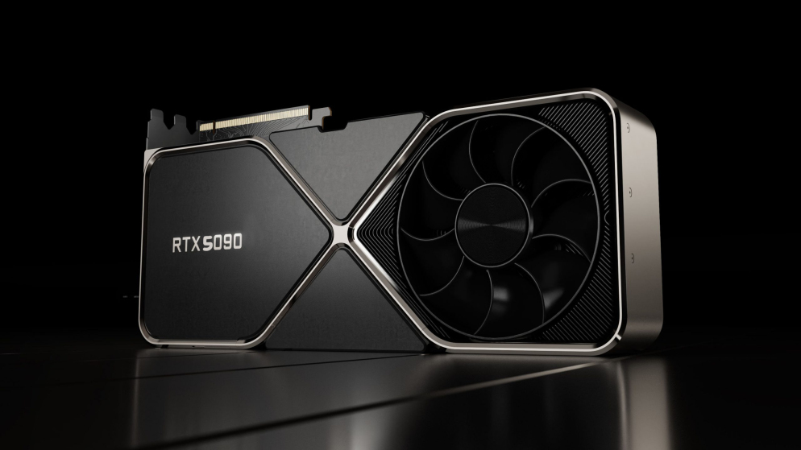
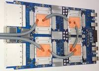
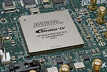
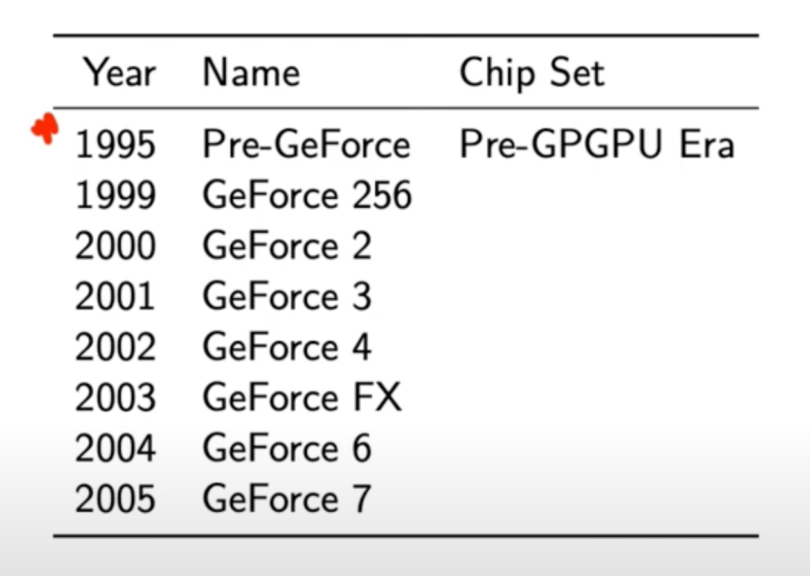
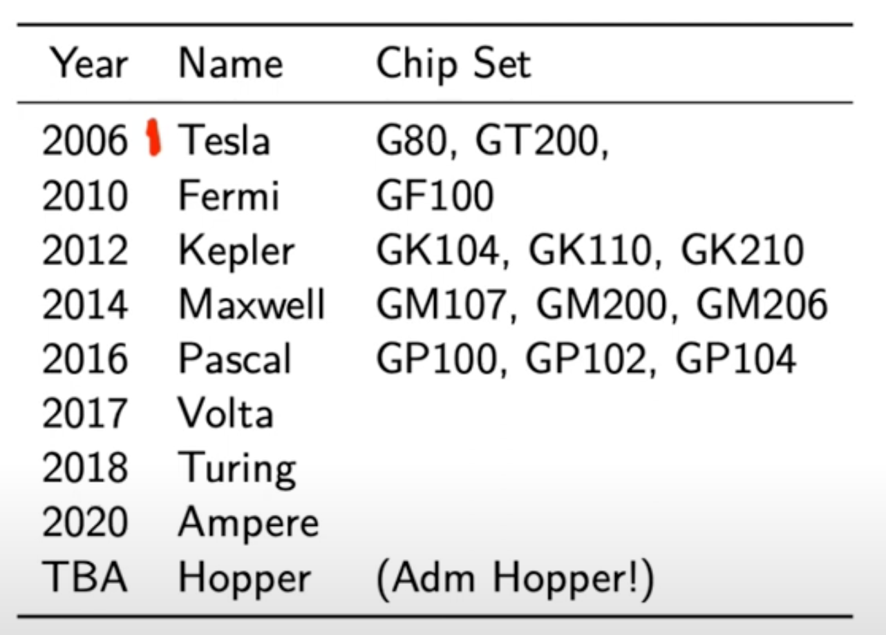
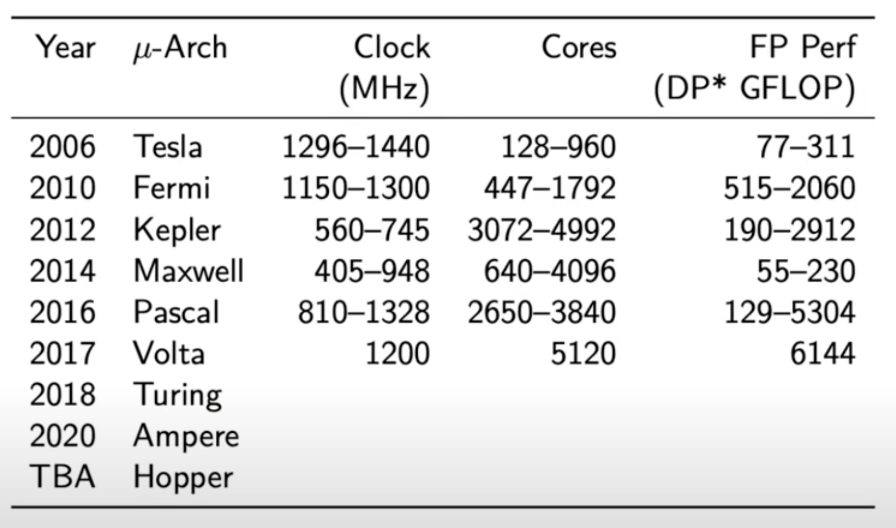

# A gentle intro to GPUs
> Данный раздел расскажет вам немного истории про GPU (Graphics Processing Unit), а также ответит, почему мы используем его для задач глубинного обучения и почему этот способ быстрее чем использание центрального процессора для этих задач.

## Hardware

- CPU: Центральный процессор (Central Processing Unit) 
    - Общее назначение
    - Высокая тактовая частота
    - Несколько ядер
    - Высокий уровень кэш-памяти
    - Низкая задержка (latency)
    - Низкая пропускная способность (throughput)

- GPU: Графический процессор (Graphics Processing Unit) 
    - Для отдельного круга задач
    - Низкая тактовая частота
    - Много ядер
    - Низкий уровень кэш-памяти
    - Высокая задержка
    - Высокая пропускная способность

- TPU: Tensor Processing Unit 
    - Специализированные графические процессоры для алгоритмов глубокого обучения (умножение матриц и т.д.)

- FPGA: Field Programmable Gate Array 
    - Специализированное оборудование, которое может быть перенастроено для выполнения конкретных задач
    - Очень низкая задержка 
    - Очень высокая производительность
    - Очень высокое энергопотребление
    - Очень высокая стоимость

## NVIDIA GPU History
> Это краткая история графических процессоров NVIDIA -> https://www.youtube.com/watch?v=kUqkOAU84bA

## What makes GPUs so fast for deep learning?

- CPU (host)
    - минимум времени для одной задачи
    - показатель: задержка в секундах

- GPU (device)
    - максимальная пропускная способность
    - показатель: пропускная способность в задачах в секунду (например, пиксели в мс).

## Typical CUDA program
1. CPU выделяет CPU-память
2. CPU копирует данные в GPU
3. CPU запускает ядро в GPU (обработка выполняется здесь)
4. CPU копирует результат из GPU обратно в CPU для чего-нибудь полезного в дальшейшем

Ядро выглядит как специальная программа; ничего не говорит о параллелизме. Представьте, что вы пытаетесь разгадать головоломку, и все, что вам дают, - это расположение каждого кусочка головоломки. Алгоритм высокого уровня был бы разработан таким образом, чтобы взять эти отдельные элементы и решить одну задачу для каждого из них: “поместите элемент в нужное место”. Если в конце все элементы собраны в нужном месте, это работает! Вам не нужно начинать с одного угла и продвигаться по всей головоломке. Вы можете собирать несколько фрагментов одновременно, если они не мешают друг другу.

## Some terms to remember
- Ядра (kernels) (не попкорн, не сверточные ядра, не ядра Linux, а GPU ядра)
- Потоки (threads), блоки, и сетка (grid)
- GEMM = **GE**neral **M**atrix **M**ultiplication
- SGEMM = **S**ingle precision (fp32) **GE**neral **M**atrix **M**ultiplication
- cpu/host/functions vs gpu/device/kernels
- CPU называется хостом. Он выполняет функции. 
- GPU называется устройством. Он выполняет функции графического процессора, называемые ядрами.

