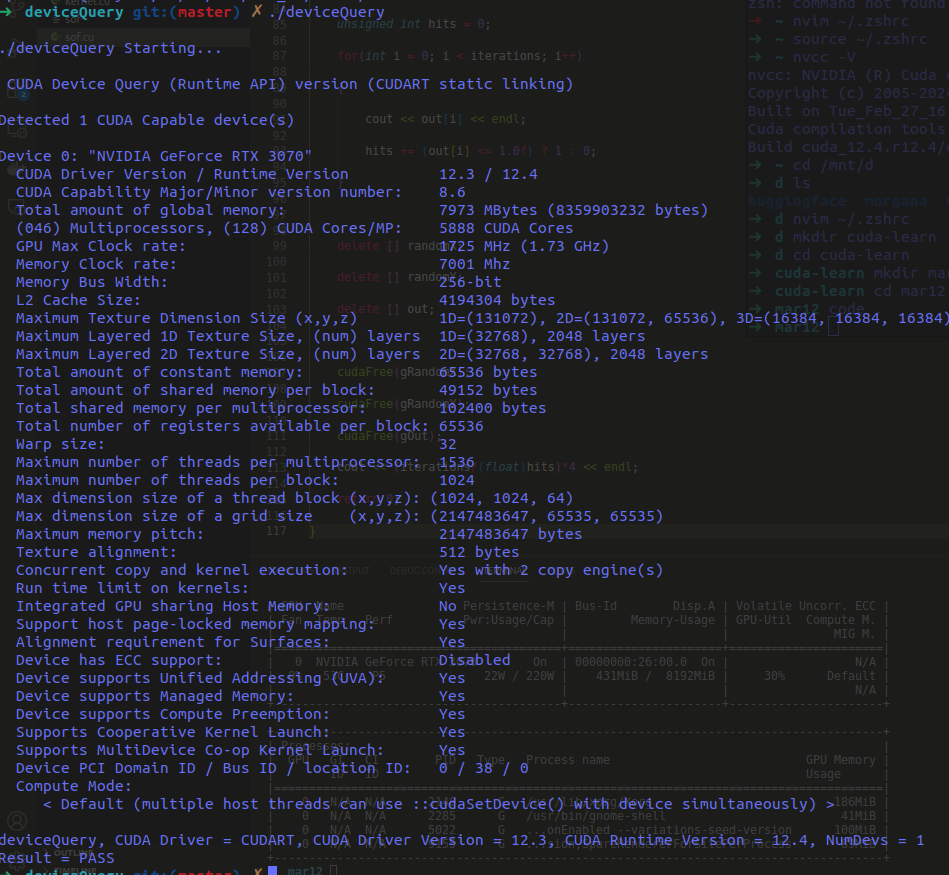
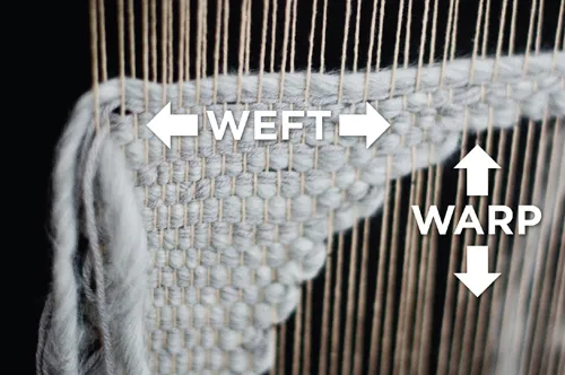
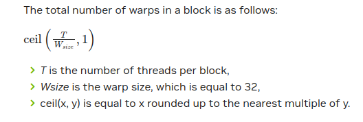

# CUDA Basics

## Lets print out some stats about your GPU



## Easy stuff
Host ⇒ CPU ⇒ Использует оперативную память (RAM), подключённую к материнской плате

Device ⇒ GPU ⇒ Использует встроенную видеопамять (VRAM) на чипе графической карты

---

CUDA-программа на верхнем уровне:

1. копирует входные данные с хоста на устройство
2. загружает и запускает программу на GPU, используя данные, переданные на устройство
3. копирует результаты обратно на хост, чтобы их можно было отобразить/использовать

---

## Device VS Host naming scheme

* `h_A` означает, что переменная “A” находится на хосте (CPU)

* `d_A` означает, что переменная “A” находится на устройстве (GPU)

* `__global__` обозначает глобально видимую функцию: такие функции могут вызываться с CPU (то есть с хоста). Обычно такие функции ничего не возвращают, но выполняют очень быстрые операции над переменными, переданными в них. Например, можно перемножить матрицы A и B, но нужно передать матрицу C нужного размера, в которую будут записаны результаты перемножения A \* B. Это и есть ядра CUDA.

* `__device__` — очень интересная функция, вызываемая **только на GPU**. Например, если в CUDA-ядре у нас есть сырая матрица скоринга внимания (attention matrix), и мы хотим применить к ней маску — это можно сделать в отдельной `__device__` функции. Это аналог вызова функции из библиотеки вместо написания её в `main.py`.

* `__host__` — функция, выполняемая только на CPU. По сути, это обычный C/C++ код без использования CUDA.

---

## Memory Management

* `cudaMalloc` выделяет память **на VRAM** (глобальной памяти GPU):

```
    float *d_a, *d_b, *d_c;

    cudaMalloc(&d_a, N*N*sizeof(float));
    cudaMalloc(&d_b, N*N*sizeof(float));
    cudaMalloc(&d_c, N*N*sizeof(float));
```

* `cudaMemcpy` может копировать:

  * с хоста на устройство ⇒ CPU → GPU
  * с устройства на хост ⇒ GPU → CPU
  * с устройства на другое место на устройстве ⇒ GPU → GPU (редко)

  Используются флаги:

  * `cudaMemcpyHostToDevice`
  * `cudaMemcpyDeviceToHost`
  * `cudaMemcpyDeviceToDevice`

* `cudaFree` освобождает память на устройстве (GPU)

---

# `nvcc` compiler

* **Хост-код**:

  * модифицируется для вызова ядер
  * компилируется в x86-бинарный файл

* **Код устройства**:

  * компилируется в PTX (Parallel Thread Execution)
  * стабильный между разными поколениями GPU

* **JIT (just-in-time компиляция)**:

  * превращает PTX в нативные инструкции GPU
  * обеспечивает *прямую совместимость* с будущими GPU

---

## CUDA Hierarchy?

1. Ядро (kernel) выполняется в потоке
2. Потоки объединяются в **блоки потоков** (Thread Blocks)
3. Блоки объединяются в **сетку** (Grid)
4. Ядро запускается как сетка блоков потоков

---

### 4 технических термина:

* `gridDim` ⇒ количество блоков в сетке
* `blockIdx` ⇒ индекс текущего блока в сетке
* `blockDim` ⇒ количество потоков в блоке
* `threadIdx` ⇒ индекс потока внутри блока

(подробнее об этом будет в видеолекциях)

---

## Threads

* Каждый поток имеет свою локальную память (регистры), которая доступна только этому потоку
* Если нужно сложить `a = [1, 2, 3, ..., N]` и `b = [2, 4, 6, ..., N]`, то каждый поток выполнит одну операцию сложения:

  * поток 1: `a[0] + b[0]`
  * поток 2: `a[1] + b[1]`
  * и т.д.

---

## Warps



* Warp — это набор нитей, натянутых на ткацком станке (из вики), идущих вдоль длины ткани — это аналог в CUDA: warp содержит **32 потока**
* Warp — это **единица параллельного исполнения** внутри блока
* Команды подаются warp’ам, которые далее управляют потоками
* Нельзя обойтись без использования warp’ов
* Планировщик warp’ов управляет их исполнением
* На каждом SM (многоядерном процессоре GPU) — по 4 warp-планировщика



---

## Blocks

* Каждый блок обладает **общей (shared) памятью**, доступной всем потокам внутри блока
* Все потоки блока исполняют один и тот же код на разных данных
* Общая память позволяет координировать действия между потоками и делать чтение/запись в память более эффективными

---

## Grids

* При выполнении ядра, потоки внутри блоков, внутри сетки, имеют доступ к **глобальной памяти** (VRAM)
* Сетка содержит множество блоков
* Хороший пример использования: батч-обработка — каждый блок в сетке обрабатывает отдельный элемент батча

---

> **Почему бы не использовать только потоки, без блоков и сеток?**
> Учитывая, что warp — это 32 потока, которые исполняются одновременно (в lockstep), использование блоков логично с точки зрения архитектуры. Кроме того, блоки позволяют делить общую память и координировать действия, чего невозможно добиться при работе с потоками напрямую.

* Логически, shared memory разделена между блоками. Это значит, что потоки **одного блока** могут обмениваться данными через общий буфер, а **между блоками** — нет.

---

CUDA-параллелизм масштабируем, потому что блоки **независимы во времени исполнения**.
То есть не обязательно запускать Block 0 → Block 1 → Block 2...
GPU может запустить Block 3 и Block 0, потом Block 6 и Block 1 — порядок неважен, пока **все части задачи** обрабатываются и результат правильно собирается.

Это похоже на сборку пазла: каждый блок решает свою часть, независимо от других, и в итоге все кусочки складываются в единое целое.

> [How do threads map onto CUDA cores?](https://stackoverflow.com/questions/10460742/how-do-cuda-blocks-warps-threads-map-onto-cuda-cores)