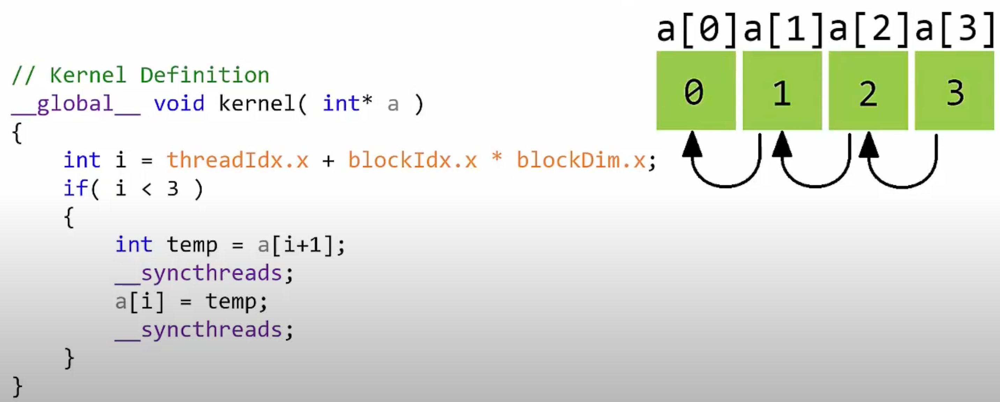

# Kernels

## Kernel Launch Params

- Тип `dim3` — это трёхмерный тип для задания размеров сетки и блоков потоков, который используется при конфигурации запуска ядра.

- Позволяет удобно индексировать элементы как векторы, матрицы или тензоры (объёмы).

```cpp
dim3 gridDim(4, 4, 1); // 4 блока по x, 4 блока по y, 1 блок по z
dim3 blockDim(4, 2, 2); // 4 потока по x, 2 потока по y, 2 потока по z
```

- Также можно использовать тип `int` для задания одномерных конфигураций:

```cpp
int gridDim = 16; // 16 блоков
int blockDim = 32; // 32 потока на блок
<<<gridDim, blockDim>>>
// это не dim3, но всё ещё допустимо при 1D индексации
```

- `gridDim` ⇒ общее количество блоков = `gridDim.x * gridDim.y * gridDim.z`

- `blockDim` ⇒ количество потоков в одном блоке = `blockDim.x * blockDim.y * blockDim.z`

- общее число потоков = (число потоков в блоке) \* (число блоков)

- Конфигурация запуска ядра задаётся в выражении вида `<<<gridDim, blockDim, Ns, S>>>`, где:

  - Dg (`dim3`) — размеры и измерения сетки
  - Db (`dim3`) — размеры и измерения блока
  - Ns (`size_t`) — объём динамически выделяемой shared memory на блок (опционально)
  - S (`cudaStream_t`) — поток CUDA, с которым ассоциирован запуск (по умолчанию 0)

> источник → [https://stackoverflow.com/questions/26770123/understanding-this-cuda-kernels-launch-parameters](https://stackoverflow.com/questions/26770123/understanding-this-cuda-kernels-launch-parameters)

## Thread Synchronization

- `cudaDeviceSynchronize();` ⇒ гарантирует, что все потоки, запущенные в ядре, завершили работу. Это как барьер. Вызывается из `int main()` или других не-`__global__` функций.

- `__syncthreads();` — барьер **внутри** ядра CUDA. Очень полезен, когда потоки работают с одной и той же областью памяти. Например, один поток может быть в процессе изменения ячейки, в то время как другой уже закончил и хочет начать её использовать. Без синхронизации возможны численные ошибки и гонки данных.

- `__syncwarps();` — синхронизирует **все потоки внутри одного warp’а** (группы из 32 потоков)

- Зачем вообще нужна синхронизация потоков? Потому что потоки выполняются **асинхронно** и **в произвольном порядке**. Если один поток зависит от результата другого, нужно явно синхронизировать выполнение.

- Пример: если мы хотим сложить два массива `a = [1, 2, 3, 4]`, `b = [5, 6, 7, 8]`, сохранить результат в `c`, а потом прибавить 1 ко всем элементам `c`, то нужно сначала **убедиться, что все потоки закончили сложение**, прежде чем начинать прибавление. Иначе получится, что к некоторым элементам прибавят 1 **до** сложения, что приведёт к неправильным результатам.

- Другой пример — побитовые сдвиги: если выполнение одной операции сдвига зависит от результата предыдущей, то **обязательно** нужно дождаться окончания первой.




---

## Thread Safety

- [Является ли CUDA потокобезопасной?](https://forums.developer.nvidia.com/t/is-cuda-thread-safe/2262/2)
- Потокобезопасный код — это код, который можно исполнять сразу несколькими потоками **без ошибок и гонок данных**.
- Гонки данных — это ситуации, когда один поток начинает следующий шаг **до** того, как другой поток завершит предыдущий шаг. Чтобы этого избежать, используется `cudaDeviceSynchronize()` — она «останавливает» все потоки и ждёт, пока они все дойдут до нужной точки.
- Представьте, что потоки бегут к финишу. Некоторые финишируют раньше, но вы **заставляете их подождать** остальных, прежде чем перейти к следующему этапу.
- Если вы хотите вызывать несколько CUDA-ядер с разных потоков CPU — читайте обсуждение по ссылке выше.

## SIMD/SIMT (Single Instruction, Multiple Threads)

- [Может ли CUDA использовать SIMD-инструкции?](https://stackoverflow.com/questions/5238743/can-cuda-use-simd-extensions)
- Аналогично SIMD (Single Instruction, Multiple Data) на CPU, CUDA использует SIMT — **одна инструкция на несколько потоков**.
- Вместо последовательного выполнения цикла `for`, каждый поток выполняет одну итерацию — и всё работает **одновременно**, что резко ускоряет выполнение. Если потоков не хватает — итерации выполняются партиями.

- Преимущества по сравнению с CPU:
  - команды выполняются **по порядку**
  - **нет предсказания ветвлений**
  - **меньше логики — больше ядер** на кристалле GPU

> Позже, в главе про оптимизацию матричного умножения, мы вернёмся к **оптимизациям с использованием warp-операций**. Подробнее: [Warp Level Primitives](https://developer.nvidia.com/blog/using-cuda-warp-level-primitives/)

- Документация: [https://docs.nvidia.com/cuda/cuda-c-programming-guide/index.html#thread-hierarchy](https://docs.nvidia.com/cuda/cuda-c-programming-guide/index.html#thread-hierarchy) говорит: «Существует ограничение на количество потоков в блоке, так как все потоки блока должны размещаться на одном мультипроцессоре (SM) и делить ограниченные ресурсы памяти». На современных GPU:
  - максимум **1024 потока на блок**
  - **32 потока в warp’е**
  - максимум **32 warp’а на блок**

## Math intrinsics
- Специальные аппаратные инструкции **только для устройства (GPU)** — для базовых математических операций
- Документация: [https://docs.nvidia.com/cuda/cuda-math-api/index.html](https://docs.nvidia.com/cuda/cuda-math-api/index.html)
- Можно использовать обычные функции от хоста (`log()` и т.д.), но они будут **значительно медленнее** на GPU.
  Используйте аналоги типа `logf()`, которые работают быстрее на устройстве.
- К флагу компиляции `nvcc` можно добавить `-use_fast_math` — тогда операции автоматически будут заменяться на быстрые device-инструкции. Это ускоряет вычисления с **почти незаметной потерей точности**.
- Флаг `--fmad=true` включает **сложение с умножением (fused multiply-add)** — ускоряет выражения вида `a * b + c`, сводя их к одной быстрой операции.
