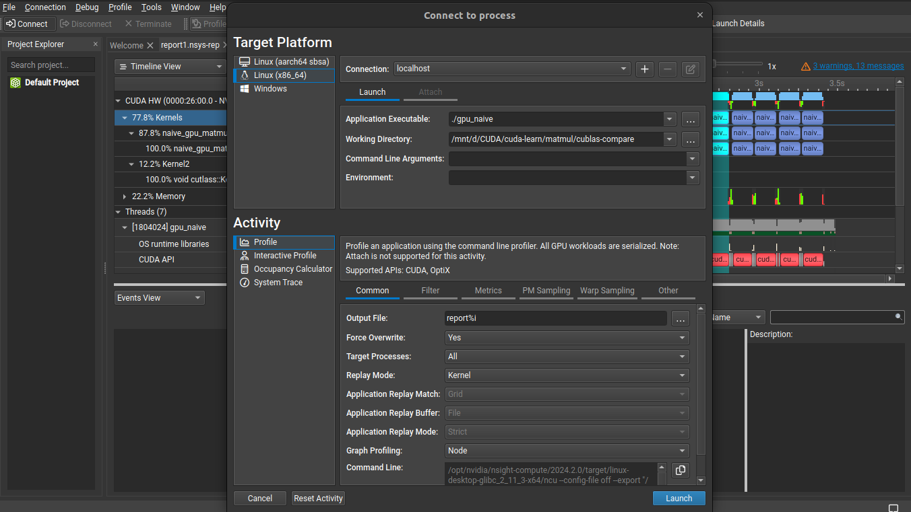
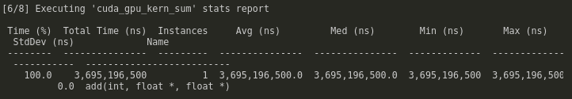
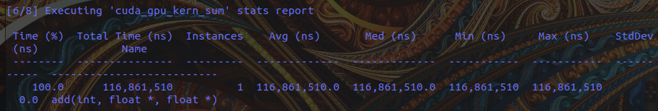
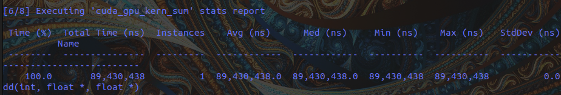

# Как настроить профиль ваших ядер CUDA

**Настройка профиля ядер CUDA (kernel profiling)** — это процесс сбора подробной информации о производительности CUDA-ядра (GPU-функции), с целью выявления узких мест, оптимизации скорости выполнения, использования памяти, загрузки вычислительных блоков и других важных аспектов.

## Follow along
1. 
```bash
nvcc -o 00 00\ nvtx_matmul.cu -lnvToolsExt
nsys profile --stats=true ./00
```

> для этих двух, вы должны открыть `ncu` на линукс и перетащите файл .nsys-rep на левую боковую панель.
> .sqlite файл может быть подключается непосредственно к базам данных sqlite для более индивидуального анализа
2. 
```bash
nvcc -o 01 01_naive_matmul.cu`
nsys profile --stats=true ./01
```

3. 
```bash
nvcc -o 02 02_tiled_matmul.cu
nsys profile --stats=true ./02
```

## CLI tools
- некоторые инструменты cli для визуализации использования ресурсов графического процессора
- `nvitop`
- `nvidia-smi` or `watch -n 0.1 nvidia-smi`


# Nsight systems & compute
- nvprof является устаревшим, поэтому вместо него мы будем использовать `nsys` и `ncu`
- Nsight системы и вычисления ⇒ `nsys profile --stats=true ./main `

- Если у вас нет конкретной цели профилирования, рекомендуется начинать с Nsight Systems для определения узких мест в системе и ядер, которые в наибольшей степени влияют на производительность. На втором этапе вы можете использовать Nsight Compute для профилирования выявленных ядер и поиска способов их оптимизации.
- https://stackoverflow.com/questions/76291956/nsys-cli-profiling-guidance
- Если у вас уже есть `.nsys-rep` файл, запустите `nsys stats file.nsys-rep` для получения более подробного количественного описания. Для `.sqlite` запустите `nsys analyze file.sqlite` для получения более подробного количественного описания
- чтобы увидеть детальный GUI для этого, я могу запустить `nsight-sys` ⇒ file ⇒ open ⇒ rep file
- `nsys` nsight система это высший уровень; `ncu` nsight вычисления для нисшего уровня
- создание файлов профилирования для python-скрипта `nsys profile --stats=true -o mlp python mlp.py`
- профиль с графическим интерфейсом nsight systems, найдите ядра, которые вам нужно оптимизировать (например, `ampere_sgemm`), откройте в режиме просмотра событий, увеличьте масштаб до выбранного на временной шкале, проанализируйте ядро с ncu, щелкнув правой кнопкой мыши на временной шкале
- ncu may deny permissions ⇒ `code /etc/modprobe.d/nvidia.conf` и принудительно измените файл nvidia.conf, добавив строку `options nvidia NVreg_RestrictProfilingToAdminUsers=0` после перезагрузки компьютера. Это была единственная проблема, с которой я столкнулся, поэтому вы можете самостоятельно решить некоторые проблемы, с которыми я не сталкивался в этом курсе. проверьте github, stackoverflow, форумы разработчиков nvidia, документы nvidia, документы pytorch, если ваша проблема связана с CUDA или triton в pytorch, chatGPT или других LLM, чтобы упростить навигацию в пространстве (обработать информацию будет не так сложно, поскольку она аккуратно организована).
    - src ⇒ 
- `compute-sanitizer ./main` for memory leaks
- kernel performance UI ⇒ ncu-ui (might have to `sudo apt install libxcb-cursor0`)

## Kernel Profiling
- [Nsight Compute Kernel Profiling](https://docs.nvidia.com/nsight-compute/ProfilingGuide/index.html)
- `ncu --kernel-name matrixMulKernelOptimized --launch-skip 0 --launch-count 1 --section Occupancy "./nvtx_matmul"`
- turns out nvidia profiling tools won't give you everything you need to optimize deep learning kernels: [Here](https://stackoverflow.com/questions/2204527/how-do-you-profile-optimize-cuda-kernels)

## Profiling Vector Addition
- при профилировании следующих 3 вариантов с добавлением вектора в 32 (2^25) миллиона элементов
    - базовый без блоков и потоков
    - 
    - w/ потоки
    - 
    - w/ потоки и блоки
    - 
- оригинал отсюда: https://developer.nvidia.com/blog/even-easier-introduction-cuda/


## NVTX `nvtx` profiling
```bash
# Compile the code
nvcc -o matmul matmul.cu -lnvToolsExt

# Run the program with Nsight Systems
nsys profile --stats=true ./matmul
```
- `nsys stats report.qdrep` to see the stats


## CUPTI
- позволяет вам создавать свои собственные инструменты профилирования
- *CUDA Profiling Tools Interface* (CUPTI) позволяет создавать инструменты профилирования и трассировки, предназначенные для приложений CUDA. CUPTI предоставляет следующие API: *Activity API*,*Callback API*, *Event API*, *Metric API*, *Profiling API*, *PC Sampling API*, *SASS Metric API* и *Checkpoint API*. Используя эти API, вы можете разрабатывать инструменты профилирования, которые дают представление о поведении CPU и GPU в приложениях CUDA. CUPTI поставляется в виде динамической библиотеки на всех платформах, поддерживаемых CUDA.
- https://docs.nvidia.com/cupti/overview/overview.html
- Поскольку CUPTI требует более сложного обучения, мы упрощаем его с помощью других инструментов профилирования в этом курсе.