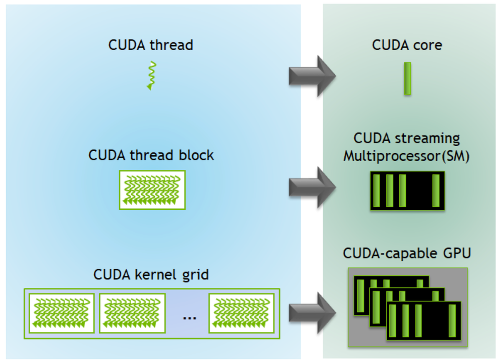

# Writing your first CUDA Kernels

> Всё для старта -> https://docs.nvidia.com/cuda/
> В основном мы ориентируемся на руководство по программированию на CUDA C -> https://docs.nvidia.com/cuda/cuda-c-programming-guide/index.html
> Подумайте о том, чтобы продолжить здесь -> https://developer.nvidia.com/blog/even-easier-introduction-cuda/

- Это хорошая практика писать код для ядра на CPU, затем на GPU, чтобы убедиться, что ваша логика выстраивается на уровне блоков и потоков. Вы можете задать некоторый входной сигнал x, передать его через функцию CPU и ядро GPU, проверить, совпадают ли выходные данные. это покажет вам, работает ли ваш графический код должным образом.

- Попрактиковаться в сложении векторов и умножении матриц вручную
- Понять концепцию потоков, блоков и сеток

## To run our compile & run our vec add kernel:

```bash
nvcc -o 01 01_vector_addition.cu
./01
```

## Hardware Mapping

- CUDA ядра обрабатывают потоки
- Потоковые мультипроцессоры (SMs) обрабатывают блоки (обычно несколько блоков на SM в зависимости от требуемых ресурсов).
- Сетки отображаются на весь графический процессор, поскольку они являются самым высоким уровнем иерархии

## Memory Model

- Регистры и локальная память
- Общая память ⇒ позволяет потокам внутри блока обмениваться данными
- Кэш L2. действует как буфер между ядрами/регистрами и глобальной памятью. также является общей памятью для SMS
- Кэш L2 и общий кэш L1 используют ту же схему, что и SRAM, поэтому они работают примерно с одинаковой скоростью. Кэш L2 больше и обеспечивает
- Скорость: Хотя оба используют SRAM, L2 обычно работает медленнее, чем L1. Это связано не с базовой технологией, а скорее с тем, что:
  - Размер: L2 больше, что увеличивает время доступа.
  - Общий характер: L2 является общим для всех SMS, что требует более сложных механизмов доступа.
  - Физическое местоположение: L2 обычно находится дальше от вычислительных блоков, чем L1.
- Глобальная память, в которой хранятся копии данных на хост и с него. Все устройства могут получать доступ к глобальной памяти mem.
- Хост ⇒ 16/32/64 ГБ оперативной памяти в зависимости от вашего устройства (эти 4 карты памяти на материнской плате)
- Массивы, которые слишком велики, чтобы поместиться в регистр, будут помещаться в локальную память. наша цель - сделать так, чтобы этого не произошло, потому что мы хотим, чтобы наша программа работала как можно быстрее




### What is _random_ access memory?

- в видеозаписи вы должны последовательно обращаться к битам, чтобы добраться до
  последних. случайность - это способ мгновенного получения информации
  из заданного случайного индекса (без необходимости индексировать что-либо еще). нам предоставляется абстракция, которая кажется, что память - это гигантская строка, но на чипе она на самом деле представлена в виде сетки (здесь обо всем заботится схемотехника).


> [Эффективное матричное умножение от Nvidia](https://developer.nvidia.com/blog/efficient-matrix-transpose-cuda-cc/)

