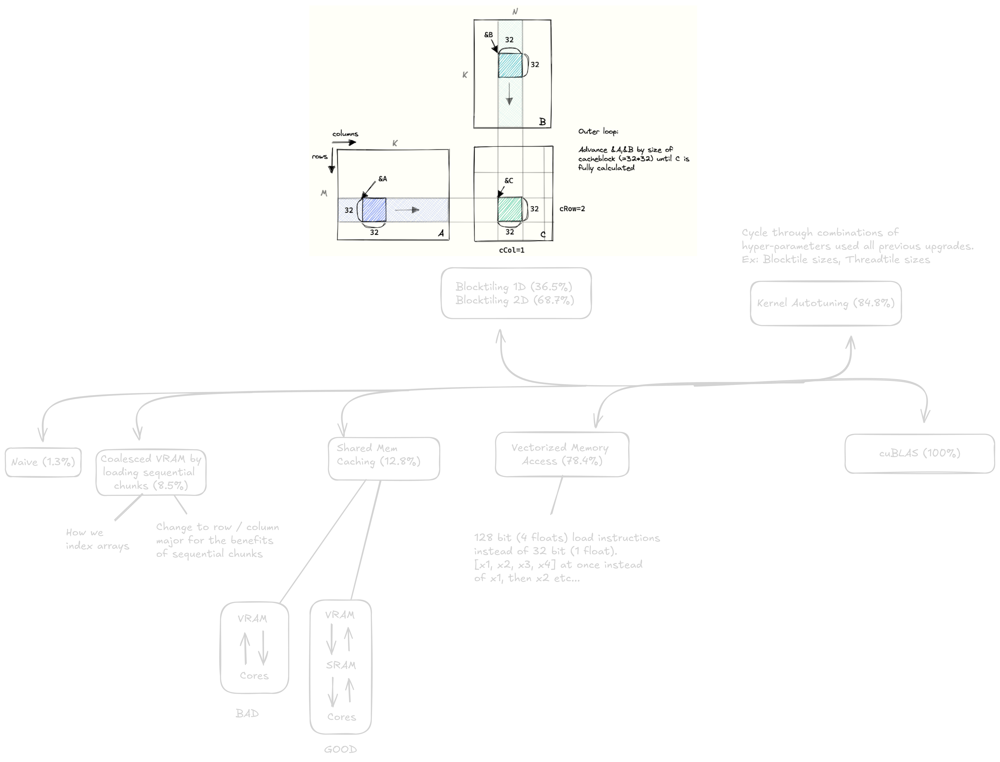

# Lets Optimize Matrix Multiplication



> Наивный (простой в понимании, но низкая производительность)
> Объединенный доступ к памяти (гарантируя, что мы загружаем данные оптимальным для графического процессора способом)
> Общая память (уменьшение количества обращений к глобальной памяти увеличивает пропускную способность памяти)
> 1D/2D Блочная обработка (распределение работы поровну между всеми SMS / блоками в сетке)
> Векторизованный доступ к памяти (загрузка большего количества данных на команду (128 бит вместо 32 бит))
> Автонастройка (поиск по сетке наиболее оптимальных параметров для вашего ядра на основе архитектуры вашего графического процессора)
> cuBLAS (Библиотека NVIDIA с закрытым исходным кодом для операций линейной алгебры, такая как Matmul)

**Мне было слишком лень писать это, так что давайте перейдем к Саймону Бему. [blog](https://siboehm.com/articles/22/CUDA-MMM) & [git repo](https://github.com/siboehm/SGEMM_CUDA)**

## Row Major vs Column Major

- cuBLAS ожидает, что матрицы будут представлены в основном формате столбцов, поэтому мы должны выполнить предварительную транспонирование
- Row Major: `A[i][j]` хранится в `A[i * N + j]`
- Column Major: `A[i][j]` хранится в `A[j * M + i]`

```python
# Row Major
A = [[1, 2, 3],
     [4, 5, 6],
     [7, 8, 9]]

# how its stored in memory
A = [1, 2, 3, 4, 5, 6, 7, 8, 9]

# Column Major
A = [[1, 4, 7],
     [2, 5, 8],
     [3, 6, 9]]

# how its stored in memory
A = [1, 4, 7, 2, 5, 8, 3, 6, 9]
```

## Цель `pragma #unroll`

- в идеале, вам бы хотелось, чтобы за итерацию выполнялось больше полезных вычислений. если вы можете выполнить 4 математические операции за 1 итерацию, это хорошо.
- в некоторых контекстах компилятор фактически разворачивает цикл, явно не сообщая ему об этом. (вот что случается с `unrolling.cu`)
- вы можете проверить код сборки PTX с помощью `nvcc -ptx v1.cu -o - | less` чтобы посмотреть, развернул ли компилятор цикл.
- написав ядро без развертывания и сравнив его с ядром, в котором есть развертывание, вы можете увидеть, будет ли развертывание
  на самом деле это полезно. затем проверьте ассемблерный код PTX, чтобы убедиться, что компилятор развернул цикл. полезно только в том случае, если вы не получаете желаемых преимуществ и нуждаетесь в дальнейшем изучении.
- в тесте quickly просто берется среднее время работы ядра и сравнивается с развернутой версией. если развернутая версия работает быстрее, то развертывание было полезным. если нет, то развертывание не принесло пользы. всегда проверяйте результаты, чтобы ваше ядро выдавало то, что должно (сравнивайте по элементам).

## Что такое занятость (occupancy)

    Занятость (Occupancy) определяется как соотношение между количеством активных перекосов на сантиметр и максимально возможным количеством активных перекосов на сантиметр.

    Существует три основных ограничения на загрузку большего количества активных блоков в SM: количество регистров, количество деформаций и емкость SMEM. Давайте проведем пример расчета для нашего текущего ядра.

    https://docs.nvidia.com/cuda/cuda-c-best-practices-guide/index.html#occupancy

> [Matmul Представление](https://docs.nvidia.com/deeplearning/performance/dl-performance-matrix-multiplication/index.html)

## Assembly Instructions:

- [PTX Инструкции (выполнение в параллельном потоке)](https://docs.nvidia.com/cuda/parallel-thread-execution/index.html#ptx-machine-model)
- [Как читать Shader Assembly (SASS)](https://interplayoflight.wordpress.com/2021/04/18/how-to-read-shader-assembly/)

### Почему нам может захотеться копаться в ассемблерном коде или писать его?

- позволяет нам понимать операции, с которыми мы связаны (например, отклонение от нормы, ожидание поступления данных в регистры, дорогостоящие операции и т.д.)
- позволяет оптимизировать тактовый цикл (максимально приближенный к тому, который вы можете получить).

## Inspired by:

1. [Simon Boehm @ Anthropic](https://siboehm.com/articles/22/CUDA-MMM)
2. [Lei Mao @ NVIDIA](https://github.com/leimao/CUDA-GEMM-Optimization)

## Take it a step further:

- Чтобы понять оптимизацию производительности ядра, которую такие компании, как NVIDIA, применяют в **matmul** для достижения высоких показателей TFLOP, наблюдаемых в cuBLAS, ознакомьтесь с cuTLASS (Шаблоны CUDA для подпрограмм линейной алгебры):
- [CUTLASS Github](https://github.com/NVIDIA/cutlass)
- [CUTLASS Blog](https://developer.nvidia.com/blog/cutlass-linear-algebra-cuda/)
- [CUTLASS Documentation](https://nvidia.github.io/cutlass/)
